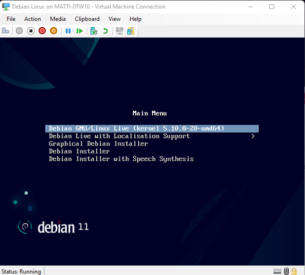
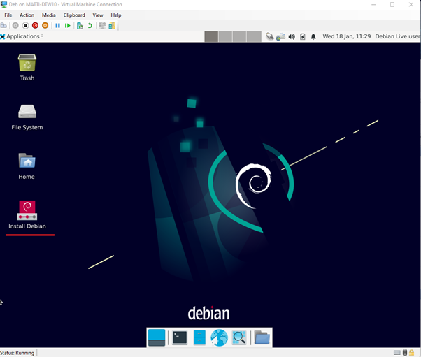
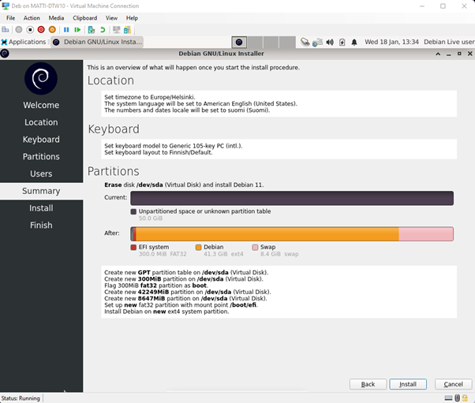
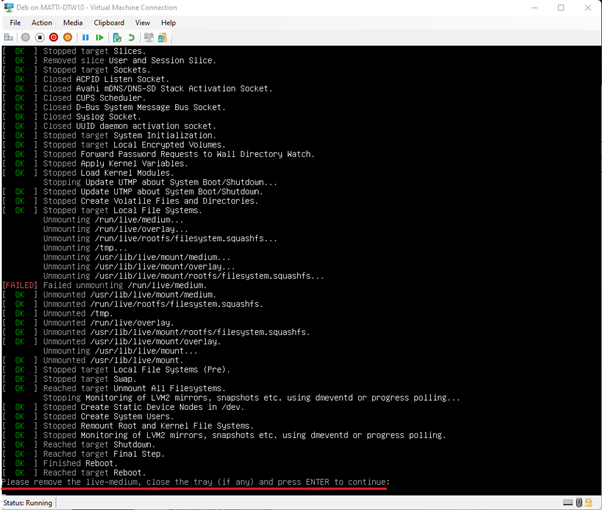
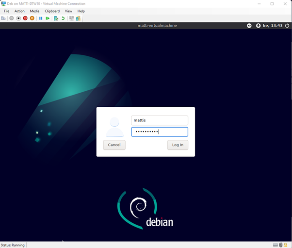
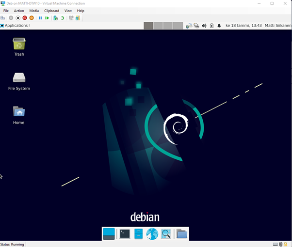

# debianasennus
Tämä on ensimmäinen tehtävä / raportti

#Debianin asennus virtuaalikoneelle

Tässä raportissa käyn läpi alusta saakka sen mitä tuli tehtyä ja mahdollisia ongelmakohtia. Aloitan käymällä läpi testiympäristöni.

## Ympäristö

Hyper-V kotikoneella
Virtuaalikoneen speksit:
- 2 x CPU
- 4 Gb RAM
- 50 Gb HDD
- Generation 2 (Hyper-V pyytää määrittelemään)

## Alustus
Alussa latasin Opettajan Teron tarjoamasta linkistä: https://cdimage.debian.org/images/unofficial/non-free/images-including-firmware/current-live/amd64/iso-hybrid/debian-live-11.6.0-amd64-xfce+nonfree.iso Debianin asennuskuvan.
Lataus kesti n. 45 minuuttia, joka johtui joko oman netin hitaudesta tai ruuhkasta Debianin sivuilla.

Loin 17.1.2023 virtuaalikoneen Hyper-V:ssä (speksit yläpuolella mainittuna) valmiuteen ennen seuraavana päivänä toteutettavaa asennusta.

## Asennus

Asennus alkoi 18.1.2023 klo 13:07 käynnistämällä virtuaalikone, levykuva boottasi ja pyysi valitsemaan Main Menu kohdassa mitä tehdään, valitsin kohdan Debian GNU/Linux Live (kernel 5.10.0-20-amd64). 
Törmäsin heti alussa ongelmaan Hyper-V:n kanssa ja jouduin vaihtamaan virtuaalikoneen Generation asetuksen 1:stä 2:ksi. luomalla uuden virtuaalikoneen alusta. Pienen selvitys työn jälkeen loin Debianin ohjeiden (https://techlabs.blog/categories/debian-linux/create-a-debian-linux-virtual-machine-using-hyper-v) mukaisesti Hyper-V:lle uuden virtuaalikoneen ja asennus alkoi klo 13:30.

Päästyäni alusta eteenpäin, päädyin Debianin livetyöpöydälle, josta pystyi valitsemaan Install Debian 
Asennusparametrit:
Language: American English
Location: Europe / Helsinki
Keyboard: Finnish (Default)
Partitions: Erase disk (automatic partition), kryptaus ei valittuna
Users: mattis (Matti Siikanen) / log in automatically without asking for the password ei valittuna

Summary:  

Tarkastelun jälkeen painettiin Install. Asennus kesti 7min (13:35-13:42). Asennuksen jälkeen kone meni boottiin ja pyysi irroittamaan siihen kytketyn levykuvan. 

Uudelleekäynnistyksen jälkeen kone siirtyi Debianin kirjautumisruutuun, joihin syötettiin asennuksen aikana annetut tunnukset:

Kirjautumisen jälkeen päästiin työpöydälle: 

## Lopetus
Kokonaisuudessaan asennukseen meni sähellyksineen noin 38 min. Harjoitus oli mielenkiintoinen ja uusi/vanha kokemus, koska en ole koskaan asentanut Debiania, mutta muita Linuxeja kyllä.

## Lähteet:

Karvinen, Tero: Oppitunti 2023-01-17, Linux-palvelimet - ICI003AS2A-3002 - Kurssi  
(https://hhmoodle.haaga-helia.fi/course/view.php?id=35775)

Debian Linux: Create a Debian Linux Virtual Machine using Hyper-V  
(https://techlabs.blog/categories/debian-linux/create-a-debian-linux-virtual-machine-using-hyper-v)
